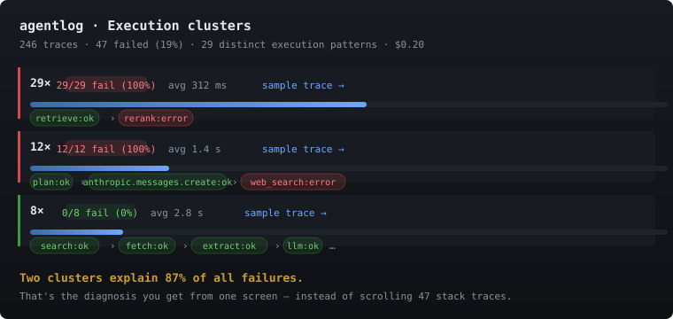

# clustertrace

A local-first debugger for LLM agents. Drop in a decorator, run your agent a few hundred times, then look at where it's failing by execution pattern rather than by individual trace.

I built it because I had a multi-step agent that was failing about 20% of the time in random-looking ways, and the only trace-tooling I had was a flat list view that didn't help. Clustering the traces by execution signature turned it from "scroll 80 stack traces" into "two patterns explain ten of the twelve failures, here they are". That's the entire pitch.



In the bundled 60-trace demo, two clusters cover 10 of the 12 failures (83%). Eighteen distinct execution patterns total. You can reproduce the numbers in 30 seconds.

## Try it without an API key

```bash
pip install clustertrace
clustertrace demo
```

Loads 60 pre-recorded traces of three agents (research, RAG, tool-use), boots a dashboard on `localhost:7777`, no API spend. (Pre-PyPI install: `pip install "clustertrace @ git+<repo-url>"` once the repo's pushed; both URLs go live on first public push.)

If `clustertrace demo` works on your machine, the rest of this README is just feature surface.

## Using it on a real agent

There are three ways to feed traces in. Pick one.

A bare decorator on the functions you want traced:

```python
import clustertrace

@clustertrace.trace(tags={"agent": "research"})
async def plan(query): ...

with clustertrace.span("retrieval", k=5):
    ...

clustertrace.tool_call("web_search", args={"q": query}, result=hits)
clustertrace.tag("user_tier", "pro")
clustertrace.metric("score", 0.85)        # numeric, aggregated to a sparkline
```

Async-safe. Concurrent `asyncio.gather` calls produce separate traces; nesting tracks the parent via `contextvars`.

Or wrap your SDK client, no decorator on your code:

```python
from anthropic import Anthropic, AnthropicBedrock, AnthropicVertex
from openai import OpenAI
import clustertrace

client  = clustertrace.wrap_anthropic(Anthropic())          # direct API
bedrock = clustertrace.wrap_anthropic(AnthropicBedrock())   # AWS Bedrock
vertex  = clustertrace.wrap_anthropic(AnthropicVertex())    # Google Vertex
oai     = clustertrace.wrap_openai(OpenAI())                # OpenAI
```

It's an explicit wrap, no global monkey-patching. Async clients (`AsyncAnthropic`, `AsyncOpenAI`) are detected automatically.

Or just point your existing OpenTelemetry setup at clustertrace as an exporter:

```python
from opentelemetry.sdk.trace import TracerProvider
from opentelemetry.sdk.trace.export import BatchSpanProcessor
from clustertrace.otel import ClustertraceSpanExporter

provider = TracerProvider()
provider.add_span_processor(BatchSpanProcessor(ClustertraceSpanExporter()))
```

If you already have OTel wired through LangChain, LlamaIndex, Bedrock auto-instrumentation, or your own custom spans, this picks them up. `gen_ai.*` and `llm.*` attribute conventions are mapped onto clustertrace's schema, so cost and clustering work on OTel-sourced traces too.

## What the dashboard shows

| page | content |
|---|---|
| `/` | filterable trace list with status/tag/name filters, live polling, per-trace cost |
| `/clusters` | distinct execution patterns: count, failure rate, sample trace, longest common failure prefix, top failing nodes |
| `/search` | FTS5 search across span name, input, output, error message; supports phrases, OR, NEAR |
| `/metrics` | per-metric aggregates and rolling sparklines for whatever you passed to `clustertrace.metric()` |
| `/failures` | per-span error-rate bars, step-of-failure histogram, force-directed call graph |
| `/trace/<id>` | Gantt timeline, expandable I/O, tags, metrics, per-span cost |

[`examples/sample-trace.html`](examples/sample-trace.html) shows a 16 KB self-contained shareable snapshot: data and renderer embedded in one file, no external assets.

## CLI

```bash
clustertrace demo                                      # one-step trial with bundled data
clustertrace dashboard                                 # launch local server
clustertrace stats                                     # one-screen DB summary
clustertrace inspect --latest                          # terminal Gantt of last trace
clustertrace inspect --failed                          # most-recent failed trace
clustertrace inspect <trace_id> --expand <span_id>     # dump that span's I/O
clustertrace mcp                                       # MCP server for AI editors (stdio)
clustertrace mcp install --target claude-code          # wire into your editor
clustertrace backfill-cost                             # compute $ for every LLM call retroactively
clustertrace backfill-signatures                       # signatures for older traces
clustertrace snapshot <trace_id> -o trace.html         # self-contained shareable HTML
clustertrace export <trace_id>                         # JSONL to stdout
clustertrace export --all > backup.jsonl               # everything
clustertrace import < backup.jsonl                     # merge (skips existing IDs)
clustertrace replay <trace_id> --entry mod:fn          # re-run with captured args
clustertrace db-path                                   # print SQLite path
```

## Use with Claude Code

Pipe Claude Code's OpenTelemetry traces into clustertrace and you get cluster, failure-pattern, and cost analysis of your *actual* Claude Code usage — which prompt shapes burn tokens, which tool sequences dominate your sessions, which stop reasons cluster around which patterns. The dashboard ships an OTLP/JSON receiver on the same port; Claude Code POSTs spans straight to it.

```bash
# 1. print the env vars (auto-detects PowerShell on Windows, bash elsewhere)
clustertrace claude-code                  # metadata only (token counts, tool names)
clustertrace claude-code --content        # also capture prompt text + tool I/O
# 2. paste the output into your shell rc
# 3. in another terminal:
clustertrace dashboard
# 4. run Claude Code as normal; traces start landing
```

Every `claude_code.interaction` becomes a trace; child `claude_code.llm_request` and `claude_code.tool` spans land as nested function calls with model, input/output tokens, cache hits, stop reason, tool name, and duration. Data stays on your machine (local SQLite). The receiver enforces a 16 MiB body cap (`CLUSTERTRACE_OTLP_MAX_BYTES` to override).

Limits worth knowing: clustertrace only accepts OTLP/JSON (not protobuf), which is why the helper sets `OTEL_EXPORTER_OTLP_PROTOCOL=http/json`. If you point another OTel exporter at it, do the same.

## Weekly review

Open `/review` for a fifteen-minute Sunday loop over your last seven days of usage. Five questions answered with SQL over your own data: top expensive sessions, cache hit rate by pattern, the pattern you ran most often, sessions that dead-ended on `max_tokens` / `refusal` / errors, and a free-text "one change for next week" you persist and mark `kept` / `partial` / `missed` the following Sunday.

The point is not to optimise &mdash; it's to pick one specific change per week and check whether you actually made it. Run for four weeks and you have a number on whether your prompting got more efficient.

## MCP server

`clustertrace mcp` exposes traces, clusters, and search through the Model Context Protocol, so any MCP-capable editor (Claude Code, Cursor, Continue) can ask "show me a failing trace of this pattern" or "diff this trace against a successful one" as a single command.

```bash
pip install "clustertrace[mcp]"
clustertrace mcp install --target claude-code   # or cursor, or continue
# restart your editor; the tools appear
```

Six read-only tools are exposed:

| tool | what |
|---|---|
| `list_clusters` | distinct execution patterns with count + failure rate |
| `get_trace` | full record (trace + spans + tags) for one trace id |
| `search` | FTS5 search over span name + I/O + error messages |
| `failure_summary` | aggregate failure-pattern view, optionally grouped by tag |
| `recent_failed` | the N most recent traces with status=error |
| `compare_traces` | structured diff (insert/delete/equal) of two traces' spans |

Without `--target`, `clustertrace mcp install` prints the JSON snippet for you to paste into your editor's config:

```json
{
  "clustertrace": {
    "command": "clustertrace",
    "args": ["mcp"]
  }
}
```

v0.9 ships read-only tools only. Annotate/assert mutation tools are slated for v1.0 once I see how the read-only surface gets used in practice.

## Configuration

| var | default | purpose |
|-----|---------|---------|
| `CLUSTERTRACE_DB` | `~/.clustertrace/traces.db` | SQLite file path |
| `CLUSTERTRACE_MAX_PAYLOAD_BYTES` | `32768` | per-field cap on serialized span I/O |
| `CLUSTERTRACE_PRICING_JSON` | (none) | override or extend the model price table |
| `CLUSTERTRACE_OTLP_MAX_BYTES` | `16777216` | body cap on `POST /v1/traces`; 413 on overflow |

## Case study

[Maintainer dogfood self-study](docs/case-studies/maintainer-dogfood.md): a synthetic research agent went from 40% failure to 15% failure after a four-line fix that the cluster page surfaced in about five seconds. Reproducible from `examples/case_study_research_agent.py`. The doc opens with what it does not prove (no real customer numbers yet); it's a dogfood report, not a testimonial.

## Where clustertrace doesn't fit

Production multi-tenant observability with teams, retention policies, PII redaction, and a managed dashboard is a different problem. clustertrace is a debug tool on a single laptop with a single SQLite file. Single-user, no auth, no persistence-tiering. It's intentionally simpler.

## FAQ

Why cluster traces instead of just listing them. Even at 60 traces (the bundled demo) the list view doesn't surface the pattern. Clustering collapses them into 18 distinct execution patterns and tells you that 2 patterns cover 10 of the 12 failures (83%). At production volumes that's the difference between reading 1000 traces and reading 2.

Why local-only with no auth. Trade-off: keeps the binary small and the trial frictionless. Single-user is the right default for a debug tool, not a production tracing service.

Does it work with LangChain / LlamaIndex / DSPy. Yes, via OpenTelemetry. Anything emitting OTel spans flows in. `gen_ai.*` and `llm.*` attribute conventions are mapped onto the clustertrace schema, so cost and clustering still work.

Streaming responses. The span is logged on completion. Chunk-by-chunk capture isn't implemented yet; v0.5 target.

How deep is the clustering algorithm. Cluster signatures use exact-string equality on a normalised, run-length-collapsed span sequence. Reorderings split clusters today: `A→B→C` and `A→C→B` end up as two clusters. Reorder-insensitive matching via set-of-edges or tree-edit-distance is the next algorithmic move. See [ARCHITECTURE.md](ARCHITECTURE.md) for the full design notes.

How much does the demo cost. Zero. The bundled 60 traces are pre-recorded. The full reproduction script ([`examples/generate_demo_data.py`](examples/generate_demo_data.py), 240 traces) costs about $2-3 in Haiku.

## Overhead

`@clustertrace.trace` adds low-microsecond decorator overhead (≈35 µs of pure-Python wrapping on modern hardware), but the SQLite write is the real per-call cost: about 5 ms on Linux/macOS, about 30 ms on Windows NTFS. End-to-end traced-call latency in `examples/benchmark.py` is dominated by the disk write, not the decorator. For a debug tool on a laptop that's fine; you don't trace 100/sec.

For production:

```python
@clustertrace.trace(sample=0.01)   # log 1% of calls
def hot_path(): ...

@clustertrace.trace(skip=True)     # zero overhead; returns the function unwrapped
def loop_body(): ...
```

Run `python examples/benchmark.py` to see the numbers on your hardware.

## Known limitations

Streaming responses are logged on completion only, not chunk-by-chunk. The `streaming: true` attribute is recorded so you can filter on it, but intermediate chunks aren't captured. v0.5 target.

Replay with prompt diff is half-built: `clustertrace replay` re-runs with captured args, but modifying the prompt before re-invocation isn't yet exposed. v0.5.

Native wrappers only for Anthropic and OpenAI. Bedrock and Vertex work through `wrap_anthropic` (they share the `.messages.create` interface). Gemini works through OpenTelemetry.

Single-user, no auth. The dashboard is intended for `127.0.0.1`. See [SECURITY.md](SECURITY.md).

## Contributing

[ARCHITECTURE.md](ARCHITECTURE.md) has the design choices; [CONTRIBUTING.md](CONTRIBUTING.md) has setup and a step-by-step recipe for adding a new SDK wrapper. Real gaps that would meaningfully help users are listed at the bottom of CONTRIBUTING.md.

## License

MIT. See [LICENSE](LICENSE).
